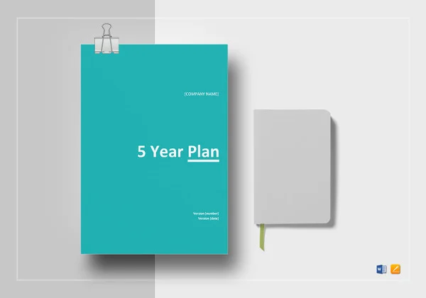

# Journal entry zero: Steps

 
1. **What would you like to be doing?** 
*–6 months from now*
*starting a job in cloud computing as IT engineer*
*–2 years from now*
*develop my career and trying to get more better position*
*–5 years from now*
*getting a senior level job in cloud computing and IT.*
1. **What would you like to learn?**
*–Within 6 months*
*how to use AWS services and get hands-on and gain experince to get everything done without tutorials.*
*–Within 2 years*
*AWS architect and get certified*
*–Within 5 years*
*AWS with AI and dig deeper in cybersecurity*
1. One thing that you could do better is managing my time in better way. 
1. What qualities do you admire in other people?
*keep trying and never give up, time management*